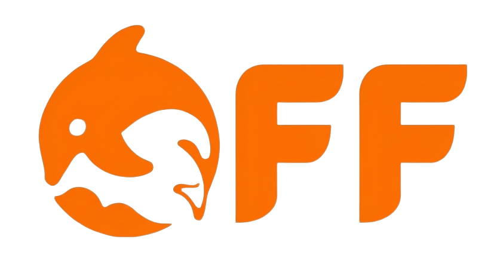

# social-auto-upload

`social-auto-upload` 是一個強大的自動化工具，旨在幫助內容創作者和運營者高效地將影片內容一鍵發佈到多個國內外主流社交媒體平台。
項目實現了對 `抖音`、`Bilibili`、`小紅書`、`快手`、`視頻號`、`百家號`、`TikTok`、`YouTube`、`Reddit`、`Twitter`、`Facebook`、`Instagram`、`Threads` 等平台的影片上傳、定時發佈等功能。
結合各平台 `uploader` 模組，您可以輕鬆配置和擴展支援的平台，並通過範例腳本快速上手。

## 💎 贊助商

<table width="100%">
 <tr>
    <td width="25%" align="center" valign="middle">
      <a href="https://chilltion.com/?ref=1y5k5k">
        
      </a>
    </td>
    <td width="75%" align="left" valign="middle">
      感謝 <a href="https://doloffer.com/" target="_blank">DolOffer</a> 對本項目的支援！對於做內容矩陣、多平台分發和 AI 自動化運營的創作者來說，ChatGPT、Claude、YouTube Premium、Spotify、Apple Music、Notion、Office 等數位工具往往是長期成本。DolOffer 提供 AI、影片、音樂和效率工具相關的訂閱與充值服務，幫助用戶更低成本地配置常用數位產品。更多說明可查看 <a href="https://github.com/Doloffer-g/guide" target="_blank">DolOffer Guide</a>。使用優惠碼 <code>AI8888</code> 可額外享受 9 折優惠，具體價格和服務規則以官網為準。
    </td>
  </tr>
</table>

---

## 目錄

- [💡 功能特性](#功能特性)
- [💾 安裝指南](#安裝指南)
- [🏁 快速開始](#快速開始)
- [🌐 支援平台](#支援平台)
- [📖 詳細文件](#詳細文件)
- [🐾 交流與支援](#交流與支援)
- [🤝 貢獻指南](#貢獻指南)
- [📜 許可證](#許可證)

## 功能特性

| 平台 | 登入/帳號準備 | 影片上傳 | 圖文上傳 | 長文 / Post | 定時發佈 | CLI | API 發佈 | 說明 |
| --- | --- | --- | --- | --- | --- | --- | --- | --- |
| 抖音 | ✅ | ✅ | ✅ | — | ✅ | ✅ | — | 當前主線重構最完整 |
| Bilibili | ✅ | ✅ | ❌ | — | ✅ | ✅ | — | 運行時自動準備 `biliup` |
| 小紅書（瀏覽器版） | ✅ | ✅ | ✅ | — | ✅ | ✅ | — | 瀏覽器自動化，CLI/Skill 已接入 |
| 快手 | ✅ | ✅ | ✅ | — | ✅ | ✅ | — | 瀏覽器自動化，CLI/Skill 初版已接入 |
| 視頻號 | ✅ | ✅ | ❌ | — | ✅ | ❌ | — | 對應 `tencent_uploader` |
| 百家號 | ✅ | ✅ | ❌ | — | ✅ | ❌ | — | 瀏覽器自動化 |
| TikTok | ✅ | ✅ | ❌ | — | ✅ | ❌ | ✅ | Content Posting API，支援 Direct Post |
| YouTube | ✅ | ✅ | ❌ | — | ❌ | ✅ | — | 瀏覽器自動化（Studio），支援播放清單/可見性 |
| Reddit | ✅ | ✅ | — | — | ✅ | ❌ | ✅ | OAuth API，支援圖片/連結/文字發文 |
| Twitter | ✅ | ✅ | — | — | ✅ | ❌ | ✅ | OAuth API |
| Facebook | ✅ | ✅ | — | — | ✅ | ❌ | ✅ | Graph API，自動延長 token |
| Instagram | ✅ | ✅ | ✅ | — | ✅ | ❌ | ✅ | Graph API，支援圖片/影片 |
| Threads | ✅ | ✅ | — | — | ✅ | ❌ | ✅ | Threads API |
| Medium | ✅ | — | — | ✅ | ❌ (草稿/立即) | ✅ | — | 瀏覽器自動化 |
| Substack | ✅ | — | — | ✅ | ✅ (定時) | ✅ | — | 瀏覽器自動化 |

### Profile 模型（多帳號管理）

每個 **Profile** 代表一個人或品牌，可擁有多個 **Account**。同一個 Profile 可以在同一個平台上持有多個帳號。

```bash
sau profile create --name "Acme Corp"
sau profile list
sau douyin login --account <account_name> --profile acme-corp
sau douyin upload-video --account <account_name> --file videos/demo.mp4 --title "標題"
```

## 安裝指南

### 自己上手使用

安裝、更新、環境準備已經統一收斂到文件：

- [安裝說明](./docs/install.md)
- [更新說明](./docs/update.md)

### Docker 部署

```bash
# 複製配置
cp conf.example.py conf.py
cp .env.example .env

# 啟動服務
docker compose up -d

# 存取 Web UI
open http://localhost:5409
```

### CLI 使用

```bash
# 安裝
uv sync --extra web

# 抖音
sau douyin login --account <account_name>
sau douyin upload-video --account <account_name> --file videos/demo.mp4 --title "標題"

# Reddit
sau reddit login --account <account_name>
sau reddit check --account <account_name>

# TikTok
sau tiktok login --account <account_name>
```

## 快速開始

### 方式 1：使用 CLI

```bash
# 抖音
sau douyin login --account <account_name>
sau douyin upload-video --account <account_name> --file videos/demo.mp4 --title "標題" --desc "描述"

# 小紅書
sau xiaohongshu login --account <account_name>
sau xiaohongshu upload-video --account <account_name> --file videos/demo.mp4 --title "標題"

# Bilibili
sau bilibili login --account <account_name>
sau bilibili upload-video --account <account_name> --file videos/demo.mp4 --title "標題" --tid 249

# YouTube
sau youtube login --account <account_name>
sau youtube upload-video --account <account_name> --file videos/demo.mp4 --title "標題" --visibility public
```

### 方式 2：使用 Web UI

1. 啟動服務：`docker compose up -d`
2. 開啟瀏覽器：`http://localhost:5409`
3. 新增帳號並登入
4. 上傳影片並發佈

## 支援平台

### Reddit

Reddit 支援兩種認證模式：

- **OAuth API**（推薦）：使用 Reddit 官方 API，需要申請 App
- **Cookie 模式**：使用瀏覽器 cookie，透過代理伺服器繞過 IP 封鎖

Reddit 封鎖資料中心 IP，需要使用住宅代理或 SSH 隧道。

### TikTok

TikTok 使用 Content Posting API：

- 支援 Direct Post 和 FILE_UPLOAD 模式
- 自動處理 chunk 上傳（5MB-64MB）
- 支援影片長度驗證、隱私設定、互動設定
- 商業內容揭露和品牌合作內容標記

### Facebook / Instagram / Threads

使用 Meta Graph API：

- 長效 token 自動延長（60天）
- 支援圖片和影片上傳
- 自動 token 過期檢測和重新授權提示

## 詳細文件

- [安裝說明](./docs/install.md)
- [更新說明](./docs/update.md)
- [CLI 使用說明](./docs/CLI.md)
- [Agent Bootstrap Prompt](./docs/agent-bootstrap.md)
- [API 速率限制與配額](./docs/api-rate-limits.md)

## 交流與支援

如果您也是獨立開發者、技術愛好者，對 #技術變現 #AI創業 #跨境電商 #自動化工具 #影片創作 等話題感興趣，歡迎加入社群交流。

## 貢獻指南

歡迎各種形式的貢獻，包括但不限於：

- 提交 Bug報告 和 Feature請求
- 改進程式碼、文件
- 分享使用經驗和教程

## 許可證

本項目暫時採用 [MIT License](LICENSE) 開源許可證。
